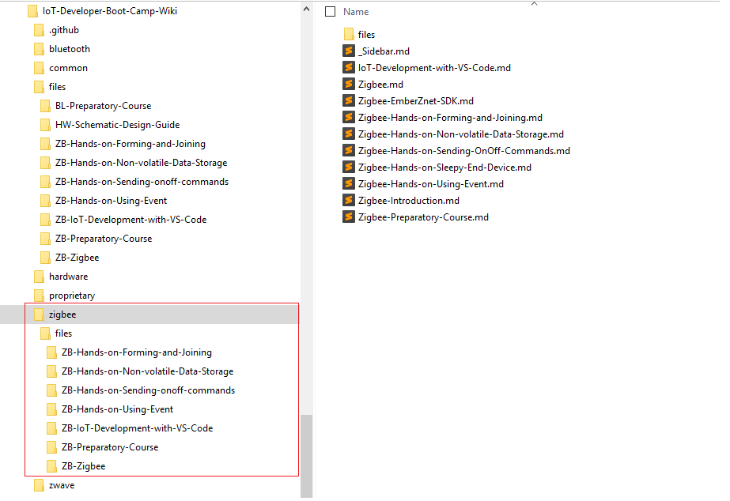
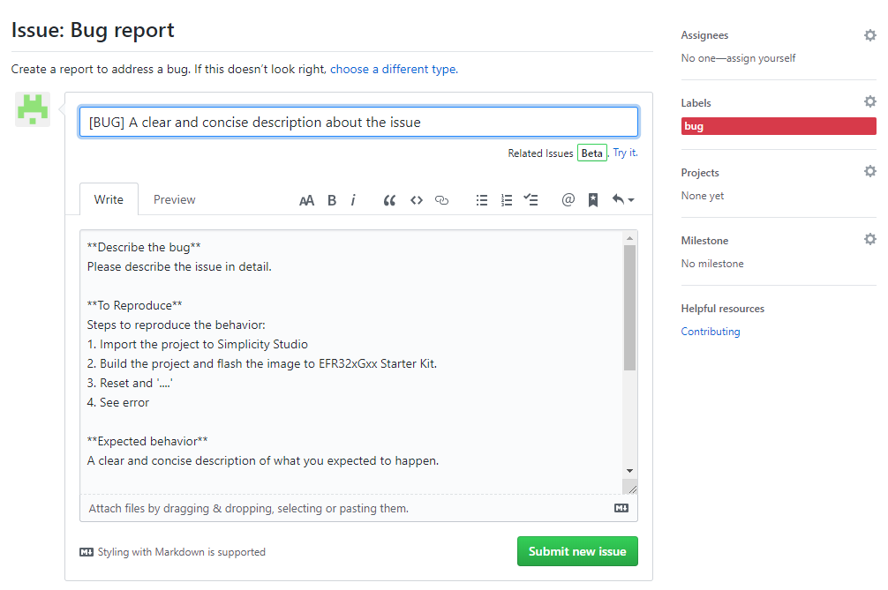
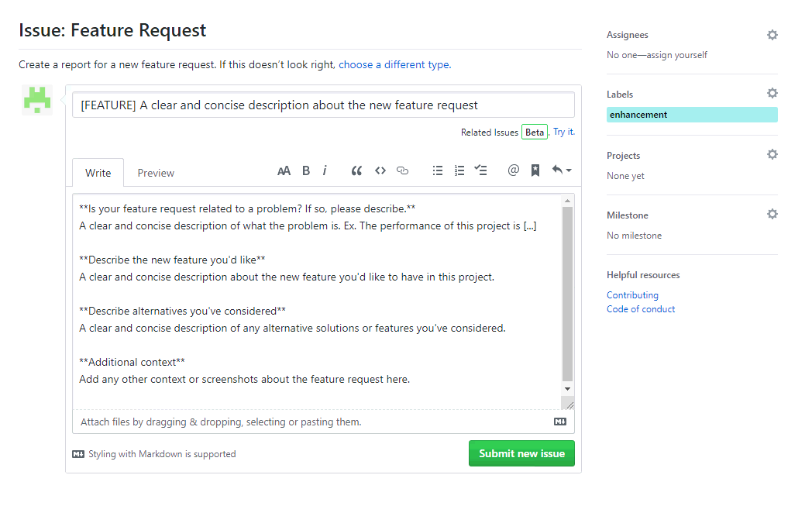
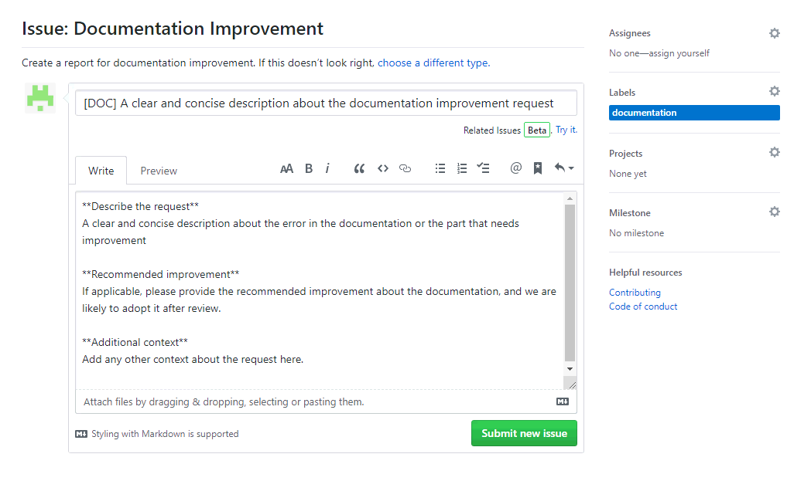
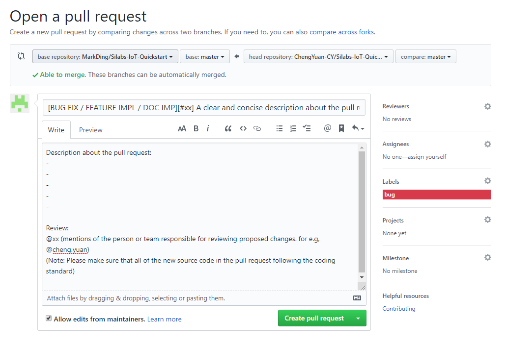
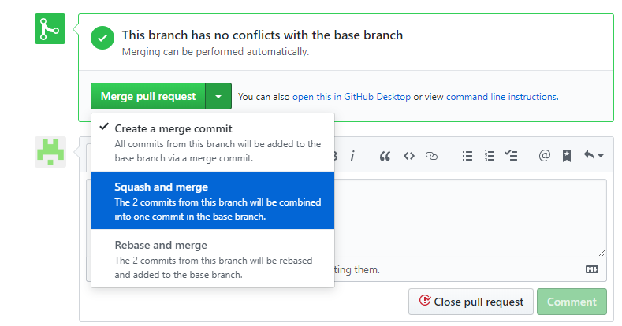

# Contributing to IoT-Developer-Boot-Camp
First of all, we really appreciate your contribution on this project!  
And please follow the guidelines below for contributing to IoT-Developer-Boot-Camp, it includes the coding standard, approaches for how to get the source code, how to report a issue to address a bug, new feature request or documentations improvement.  

---

# Table of Contents
- [1. Code of Conduct](#1-code-of-conduct)
- [2. Contributing Guideline](#2-contributing-guideline)
    - [2.1. Coding Standard](#21-coding-standard)
    - [2.2. Documentation Rule](#22-documentation-rule)
        - [2.2.1 Directory structure](#221-directory-structure)
        - [2.2.2 Naming folder and documentation](#222-naming-folder-and-documentation)
        - [2.2.3 Documentation translation](#223-documentation-translation)
    - [2.3. How to Get Code ?](#23-how-to-get-code-)
    - [2.4. Reporting Issues](#24-reporting-issues)
        - [2.4.1. Bug Report](#241-bug-report)
        - [2.4.2. New Feature Request](#242-new-feature-request)
        - [2.4.3. Documentation Improvement](#243-documentation-improvement)
    - [2.5. Pull Requests](#25-pull-requests)
- [3. Reversion Information](#3-reversion-information)

--- 

# 1. Code of Conduct
All of the contributor involved in this project is governed by the [IoT-Developer-Boot-Camp Covenant Code of Conduct](https://github.com/MarkDing/IoT-Developer-Boot-Camp/blob/master/CODE-OF-CONDUCT.md). This is a open source project, and every participating in it can provide your comments on it, submit your pull request for bug fix, new feature implementation or documentation improvement.  

---

# 2. Contributing Guideline
## 2.1. Coding Standard
All of the source code of this project are hosted by the repository [IoT-Developer-Boot-Camp](https://github.com/MarkDing/IoT-Developer-Boot-Camp/), for contributing your source code, please refer to the [coding standard](https://github.com/MarkDing/IoT-Developer-Boot-Camp/blob/master/CODING-STANDARD.md) for the description about the coding standard used in the IoT-Developer-Boot-Camp project.  

## 2.2. Documentation Rule
Every GitHub repository comes equipped with a section for hosting documentation, called a wiki. In this project, all of the documentation of the repository are hosted in the [Wiki](https://github.com/MarkDing/IoT-Developer-Boot-Camp/wiki).  
Wikis are available to the public in public repository, which is [IoT-Developer-Boot-Camp-Wiki](https://github.com/MarkDing/IoT-Developer-Boot-Camp-Wiki) in this project, user can access and contribute the documentations by following the [code of conduct](https://github.com/MarkDing/IoT-Developer-Boot-Camp/blob/master/CODE-OF-CONDUCT.md). For contributing to this repository, it highly recommended to write content in Markdown.  

### 2.2.1 Directory structure
There are several different directories for different wireless sub projects in the Wiki repository [IoT-Developer-Boot-Camp-Wiki](https://github.com/MarkDing/IoT-Developer-Boot-Camp-Wiki), such as Zigbee, Bluetooth, Proprietary respectively. All of the markdown files of the sub projects should be placed in the associated directory. In addition, there is a dedicated subdirectory ***files*** in each directory used for organizing all of the attachments of the sub projects, that includes images, scripts, slides and any other documentations except markdown.  

The directory structure of the Wiki repository seems like below. 

  

   **zigbee**: documentations for the Zigbee boot camp.  
   **bluetooth**: documentations for the Bluetooth boot camp.  
   **proprietary**: documentations for the Proprietary boot camp.  
   **zwave**: documentations for the ZWave boot camp.  
   **hardware**: documentations for the Hardware boot camp.  
   **common**: documentations for the fundamental IoT introduction, wireless fundamentals.  
   **files**: Contains all of the copy of the subdirectories in the **files** folder of each sub projects.  

### 2.2.2 Naming folder and documentation
Please note that all of the folder name and file name includes documentations and images should be connected with dash line '-' if multiple words present. And a subdirectory under the ***files*** folder is required to organize the materials for each topic, the subdirectory name should same as the associated markdown file of that topic except following a prefix for better readability.  
Take the Zigbee hands on topic "Hands on : Forming and Joining" as example, there are many screenshots and script are included in this documentations, we created a subdirectory "ZB-Hands-on-Forming-and-Joining" under the ***files*** folder to organize the screenshots and script, the prefix "ZB" refers to "Zigbee". The table below defines different prefix for different wireless sub projects.  

Wireless Protocol | Prefix
-|-
zigbee | ZB
bluetooth | BL
proprietary | PR
zwave | ZW
hardware | HW
common | CM

We didn't define the naming rule about the images, however, the basic principle is that use the clear abbreviations to avoid too long file name, and make sure the name convey the purpose of the picture (or screenshot) as clearly as possible.  

### 2.2.3 Documentation translation
Translate the existing documentations in this repo to any other language is really appreciated, and it will be helpful to the non-English native reader in understanding the content better. Because there are lots of specific terms appear in the wireless protocol specifications and Silicon Labs official documentations, we defined the conventions for documentations translation in each sub project as a guideline. 
[Conventions of Chinese translation for Zigbee Boot Camp project](https://github.com/MarkDing/IoT-Developer-Boot-Camp/wiki/Zigbee-Conventions-of-Chinese-translation)

## 2.3. How to Get Code ?
The user can access and read the source code online [here](https://github.com/MarkDing/IoT-Developer-Boot-Camp), or clone all source code from github to local with command line or GUI tool (for e.g., [Github Desktop](https://desktop.github.com/)).  
Please note that in order to maintain the repository effectively, we only grant user permissions of reading, and user cannot commit the changes to these repositories directly.  
For contributing, the recommended approach is that forking the repository firstly, and then clone your own forked repository. You can commit any changes to the fork by following the [Coding Standard](#21-coding-standard) and [Documentation Rule](#22-documentation-rule). And then open a Pull Request to the upstream repository in your fork.  
If use the command line, clone the repo with this command:  
`git clone https://github.com/<your github name>/IoT-Developer-Boot-Camp.git -b <branch_name>`

please refer to the section [Pull Request](#25-pull-requests) for how to contribute your source code and documentations to the repository.  

## 2.4. Reporting Issues
This section guides you how to report a issue to us. We created three templates for different report type, **Bug Report**, **Feature Request** and **Documentation Improvement** request.  

### 2.4.1. Bug Report
Since there are so many contributor work on this project worldwide, it's always encouraged to search the issue list to check if this issue already exist, if so you don't need to create a duplicated one, and please just add your comments on the existing one.  
And also please make sure that the issue can be reproduced reliably with the steps you provided.  
Navigate to the main page of the [IoT-Developer-Boot-Camp](https://github.com/MarkDing/IoT-Developer-Boot-Camp/) repository, choose the **Issues** tab and click the button . There are multiple issue types, choose the **Bug Report** to report a Bug you found in this project.  
Please help to provide the information as detailed as possible while creating a Bug report, the will help maintainers a lot for reproducing the issue.  

  

* **Title:** A clear and concise description about the issue can highlight the focus of this issue, please note that the prefix **[BUG]** is mandatory in the title field.  
* **To Reproduce:** Describe the steps for reproducing the issue as detailed as possible.  
* **Expected behavior:** Describe the symptom that you observed after following the steps above.  
* **Screenshots:** Provide screenshots to demonstrate the problem. Sometimes a GIF can provide us much more information than a static picture. [ScreenToGif](https://www.screentogif.com/) is a free and very easy to use tool for creating gif file.  
* **Additional context:** You can add any other context not included in the items above but it's helpful for describing this problem here.  

### 2.4.2. New Feature Request
You can submit your ideas about new features by submitting a "New Feature Request". In order to come up with a good New Feature proposal, please seriously consider your proposal before submitting it, and make sure it's reasonable and the user of this project will benefit from this new feature.  
Navigate to the main page of the [IoT-Developer-Boot-Camp](https://github.com/MarkDing/IoT-Developer-Boot-Camp/) repository, choose the **Issues** tab and click the button . There are multiple issue types, choose the **Feature Request** to submit a request for your proposal.  

Please help to provide the information as detailed as possible while submitting a New Feature Request, they will help maintainer a lot for evaluating and implementing the new feature.  

  

* **Title:** A clear and concise description about the new feature request, and all of the reader of this request can get the point quickly. please note that the prefix **[FEATURE]** is mandatory in the title field.  
* **Is your feature request related to a problem? if so, please describe:** If this new feature is suggested solution for some problem your are facing while using this project, if so, please provide a clear description here.  
* **Describe the new feature you'd like:** Please describe the new feature in detail.  
* **Describe alternative you're considered:** If there is any alternative solutions or features you've considered, please make a description here, it will help us evaluating it.  
* **Additional context：** You can add any other context not included in the items above but it's helpful for describing the new feature request here.  

After receiving the new feature request, we (and all of the contributor) will help to evaluate that proposal and check if it against the roadmap, and we will update the status of this request depends on the result of evaluation.  
**Approved:**
We believe that the proposal is reasonable and realizable, we will update the status of this request with the schedule information.  
**Pending:**
We believe that the proposal dees not fit our roadmap at this moment, and set the status of this request as pending that we will consider it later.  

### 2.4.3. Documentation Improvement
There are lots of documentations included in the boot camp [Wiki](https://github.com/MarkDing/IoT-Developer-Boot-Camp/wiki), if you found any problem within the documentations or any suggestion about the documentation improvement, please submit a "Documentation Improvement" issue to address this request.  
Navigate to the main page of the [IoT-Developer-Boot-Camp](https://github.com/MarkDing/IoT-Developer-Boot-Camp/) repository, choose the **Issues** tab and click the button . There are multiple issue types, choose the **Documentation Improvement** to submit a request for documentation improvement.  

  

* **Title:** A clear and concise description about the documentation improvement request. Please note that the prefix **[DOC]** is mandatory in the title field.  
* **Describe the request:** If there is any error you found in the documentation, please describe it as [file name][line number][description]. And provide a clear and concise description if any suggestion about the improvement.  
* **Recommended improvement:** If applicable, please provide the recommended improvement about the documentation, and we will likely to adopt it after review.  
* **Additional context：** You can add any other context not included in the items above but it's helpful for describing the documentation improvement.  

## 2.5. Pull Requests
In order to maintain the repository more effectively, we only grant the contributor read permissions, so if you want to contribute your source code, please fork the [IoT-Developer-Boot-Camp](https://github.com/MarkDing/IoT-Developer-Boot-Camp/) repository first, and then commit changes to your fork and submit your pull request.  
And as introduced before, another public repository [IoT-Developer-Boot-Camp-Wiki](https://github.com/MarkDing/IoT-Developer-Boot-Camp-Wiki) is used for hosting documentations. If you want to contribute documentations, you need to fork the [IoT-Developer-Boot-Camp-Wiki](https://github.com/MarkDing/IoT-Developer-Boot-Camp-Wiki) repository as what you did above.  
For more information, please see [Creating a pull request from a fork](https://help.github.com/en/articles/creating-a-pull-request-from-a-fork).  

For creating a pull request from your fork, open your fork of the repository, click the "New pull request" button, a new page titled **Comparing changes** will be opened, by default, there are two branches will be shown in this page, the base repository and head repository. Please check them carefully and make sure those make sense as you are about to bringing your changes into the upstream version. Click the  to start to submit your pull request as below.  

  

* **Title:** A clear and concise description about the pull request, there are three different kind of pull request, [BUG FIX] for bug fix, [FEATURE IMPL] for new feature implementation and [DOC IMP] for documentation improvement respectively. At least, one prefix of these three is mandatory in the title field. And the prefix should be followed by the issue ID [#xx] if this pull request is for a recorded issue.  
* **Description about the pull request:** Please describe this pull request in detail. It can be a summary of all of the commits included in the pull request.  
* **Review:** Please add the mentions of the person or team responsible for pull request reviewing. Please see the [Maintainers](https://github.com/MarkDing/IoT-Developer-Boot-Camp/blob/master/README.md#maintainers) list of this repository.  

The maintainer of this repository will receive the pull request from the contributor, and they need to review the source code or documentation change, and make sure that all of the source code change follow the [coding standard](#21-coding-standard) and [Documentation Rule](#22-documentation-rule). And it's required to squash the multi commits included in the pull request into one commit in the base branch. And reviewer will summarize the combined commit message.  

  

# 3. Reversion Information
**Revision 1.1**
   * 2019-12-27  
   * Elaborate on the documentation rule  

**Revision 1.0**
   * 2019-09-25  
   * Initial Revision  
