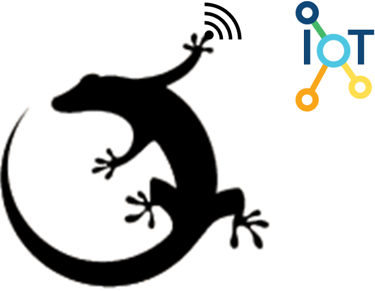

# Silabs-IoT-Quickstart
 

  

 

 

English | [Chinese](./README_CN.md)

Quickly get started with Silicon Labs IoT product.

--------------------------------------
 

  

 

 

## Table of Contents

- [Background](#background)
- [Architecture](#architecture)
- [Install](#install)
- [Usage](#usage)
- [Maintainers](#maintainers)
- [Contributing](#contributing)
- [Changelog](#Changelog)
- [FQA](#FQA)
- [License](#license)

## Background
We have many resources on https://www.silabs.com/support/training, but it is too many for a true beginner. We provide stuff here may help you easier to get start.
## Architecture

## Install
https://www.silabs.com/products/development-tools/software/simplicity-studio
## Usage

## Maintainers
[@Mark](mark.ding@hotmail.com)
## Contributing
[@Cheng](xxx)

[@Jim](xxx)

## [Changelog](./Changelog.txt)

## [FAQ](./FAQ.txt)
--------------------------------------

# License 

All resources of this repository are released under license [CC BY-NC 4.0](https://creativecommons.org/licenses/by-nc/4.0/)
