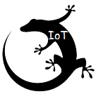
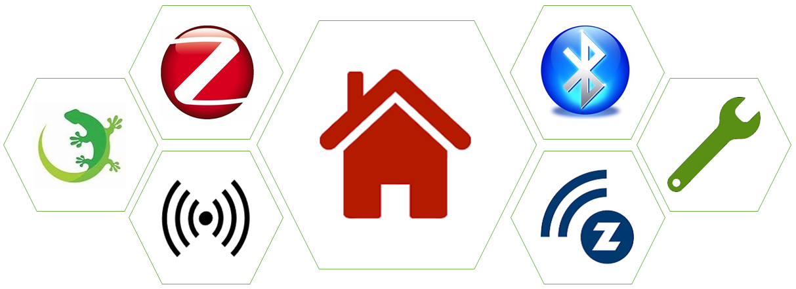

  

English | [Chinese](./README_CN.md)

  

## Table of Contents

- [Background](#background)
- [Architecture](#architecture)
- [Install](#install)
- [Usage](#usage)
- [Contribution](#Contribution)
- [Maintainers](#maintainers)
- [Contributors](#contributors)
- [Community](#Community)
- [Changelog](#Changelog)

## Background
We would like to provide a quick start guide for those customer who are really new on our wireless product, to get the project quickly setup and put it into the production. After 1 day training course，the customer should be in entry level, able to get fundamental knowledge of the protocol and able to start their project.

## Architecture

- Home 
- Zigbee 
- Bluetooth
- Proprietary
- Zwave
- platform
- Hardware

## Install
Get and install [Simplicity Studio](https://www.silabs.com/products/development-tools/software/simplicity-studio) and SDKs.

## Usage
 - Read document on [Github wiki](https://github.com/MarkDing/IoT-Developer-Boot-Camp/wiki)
 - Clone hands-on code from github to local: git clone https://github.com/MarkDing/IoT-Developer-Boot-Camp.git -b <branch_name>

## Contribution
 - Please refer to [Contributing Guideline](./CONTRIBUTING.md).

## Maintainers
[

  ](mark.ding@hotmail.com)

## Contributors

  
  
    
    
  
  

## Community
 - Slack
 - [Silicon Labs Forum](https://www.silabs.com/community)
 - [gitter](https://gitter.im/IoT-Developer-Boot-Camp/community)

## [Changelog](./Changelog.md)

